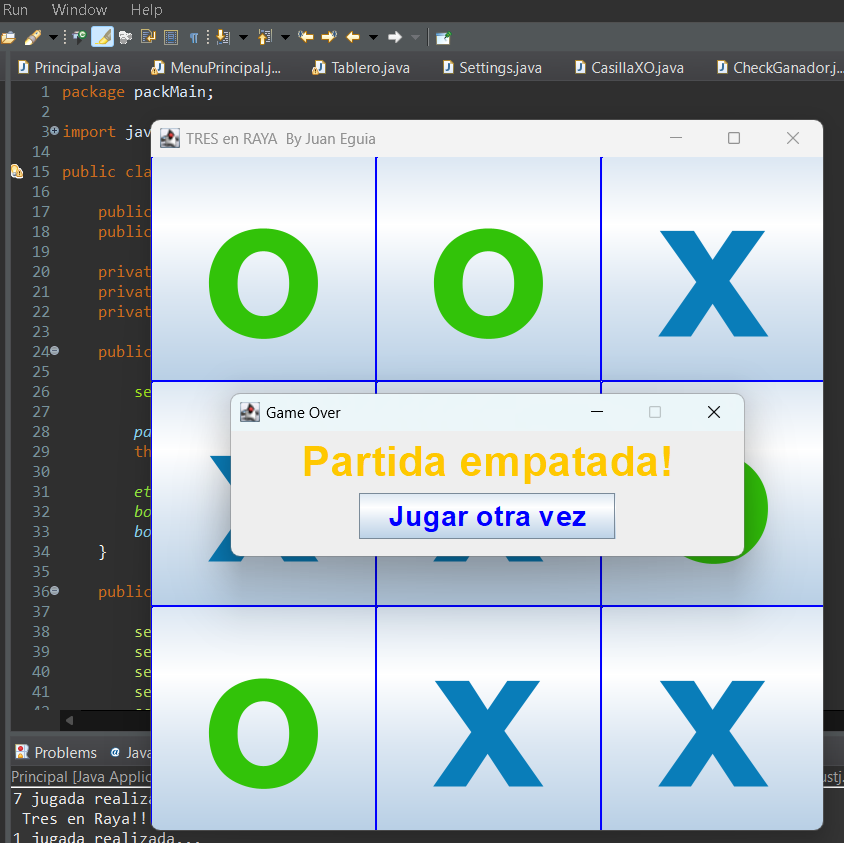

# Sencillo proyecto del juego TRES EN RAYA (TicTacToe) en Java

Archivos que componen la carpeta (package) packMain:

<li>CasillaXO.java -> clase donde creamos una casilla X, O, o null (por defecto)</li>

<li>CheckGanador.java -> clase donde checkeamos si hay un ganador o empate</li>

<li>GameOver.java -> clase donde se crea la ventana modal al finalizar el juego</li>

<li>MenuPrincipal -> Simplisimo menu de inicio (elegir quien comienza)</li>

<li>Principal.java -> contiene el método main e instancia el MenuPrincipal</li>

<li>Tablero.java -> clase que crea el tablero de juego, compuesto por un array
de 9 casillasXO, y donde están los métodos para hacer nuestras
jugadas y donde juega también la CPU</li>

